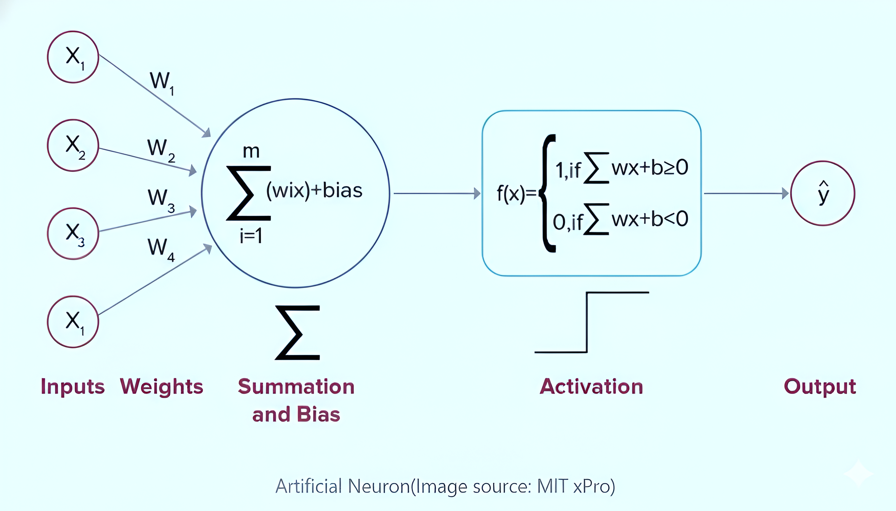

### Theory

#### Introduction to Perceptrons

The perceptron is the simplest form of artificial neural network, invented by Frank Rosenblatt in 1958. It is a binary classifier that learns to separate data points into two classes using a linear decision boundary. A perceptron computes a weighted sum of its inputs, adds a bias term, and applies a step activation function to produce a binary output. The basic structure and working of a single-layer perceptron are illustrated in Fig. 1.

> *"The perceptron is a type of linear classifier, i.e., a classification algorithm that makes its predictions based on a linear predictor function combining a set of weights with the feature vector."* — Rosenblatt, 1958

A single-layer perceptron consists of the following components:

**1. Inputs (x₁, x₂, ..., xₙ)**

The features or data values that the perceptron receives to make decisions. These are like the raw information fed into the model. These input nodes and their connections to the perceptron are shown in Fig. 1.

*Example:* For the XOR problem, we have two binary inputs x₁ and x₂, each can be either 0 or 1.

**2. Weights (w₁, w₂, ..., wₙ)**

These are importance scores that determine how much each input contributes to the final prediction. A larger weight (positive or negative) means that input has greater influence. The weighted connections between inputs and the summation unit are shown in Fig. 1.

- Each input gets its own weight, acting as a multiplier for that feature
- Weights control the angle or tilt of the decision boundary line

**3. Bias (b)**

An adjustable constant added to the weighted sum that shifts the decision boundary's position.

- Bias allows the line to move freely in space to better separate the classes
- Bias controls the position or shift of the decision boundary line

**Key Difference Between Weights and Bias:**

- **Weights** determine the *slope* , how steep the line is and its direction
- **Bias** determines the *position* , where the line sits in the coordinate space

Together they define a complete line, similar to y = mx + c, where weights act like slope 'm' and bias acts like y-intercept 'c'. The bias term $w_o(t) = \theta$ is as seen in Figure 1.

**4. Net Input (Weighted Sum)**

The perceptron combines all inputs, weights, and bias into a single numerical value:

**z = w₁·x₁ + w₂·x₂ + ... + wₙ·xₙ + b

This can be thought of as calculating a "score" — multiply each input by its weight, sum them all together, then add the bias. This score determines the predicted class. The summation operation (Σ) is shown in Fig. 1.

**5. Activation Function (Step Function)**

The activation function converts the numerical score into a binary decision:

**ŷ = 1 if z ≥ 0**

**ŷ = 0 if z < 0**

- If the score z is positive or zero → predict Class 1
- If the score z is negative → predict Class 0
- This creates a threshold at z = 0 where the perceptron switches between classes
- The resulting decision boundary is always a straight line (linear), which is why perceptrons can only solve linearly separable problems

The step activation function and output of the perceptron are shown in Fig. 1.

**Fig. 1.** Fig. 1: Architecture of a Single-Layer Perceptron showing inputs, weights, summation unit, bias, and step activation function.

---

#### Perceptron Learning Algorithm

The perceptron learns through a simple trial-and-error process. It makes predictions, checks if they're correct, and adjusts its parameters when it makes mistakes. This is called supervised learning because we provide the correct answers during training.

**The Learning Process:**

**Step 1: Make a Prediction**

The perceptron calculates its weighted sum and makes a prediction:

- z = w₁·x₁ + w₂·x₂ + ... + wₙ·xₙ + b
- ŷ = 1 if z ≥ 0
- ŷ = 0 if z < 0

**Step 2: Check if the Prediction is Correct**

Compare the predicted output (ŷ) with the actual correct label (y):

**error = y - ŷ**

- If error = 0: The prediction was correct, no changes needed
- If error = +1: The perceptron predicted 0 but should have predicted 1 (underestimated)
- If error = -1: The perceptron predicted 1 but should have predicted 0 (overestimated)

**Step 3: Update the Weights (Learn from Mistakes)**

When the perceptron makes an error, it adjusts each weight to reduce that error:

**wᵢ = wᵢ + Learning Rate × error × xᵢ**

where:

- **Learning Rate** : Learning rate: Controls how big the adjustment steps are
- **error** : Tells us the direction and magnitude to adjust
- **xᵢ** : The input value that contributed to this weight

*Example:* If the perceptron predicted 0 but the answer was 1, the error is +1, so weights connected to active inputs (xᵢ = 1) increase, making the perceptron more likely to predict 1 next time.

**Step 4: Update the Bias (Shift the Boundary)**

The bias is adjusted similarly, but without multiplying by any input:

**b = b + Learning Rate × error**

This shifts the decision boundary to better separate the classes.

**Step 5: Repeat for All Training Examples**

The perceptron goes through every data point in the training set, making predictions and adjusting weights. One complete pass through all data points is called an epoch.

**Step 6: Train for Multiple Epochs**

The process repeats for several epochs. With each epoch:

- The decision boundary moves and rotates
- Classification accuracy typically improves
- The perceptron gets closer to the correct solution (if one exists)

**Step 7: Convergence or Stopping**

Training stops when either:

- **Convergence:** All training examples are classified correctly (only possible for linearly separable data)
- **Maximum epochs reached:** We've trained for a fixed number of epochs

**Important Note:** For linearly separable problems like AND or OR gates, the perceptron will eventually find a perfect solution. However, for non-linearly separable problems like XOR, the perceptron will never converge and will continue making errors indefinitely, which is exactly what we observe in this experiment.

---

#### Linear Separability

A dataset is **linearly separable** if there exists a straight line (in 2D), plane (in 3D), or hyperplane (in higher dimensions) that can perfectly separate the two classes. Single-layer perceptrons can only learn linearly separable patterns.

**Examples of linearly separable problems:**

- **AND gate:** (0,0) → 0, (0,1) → 0, (1,0) → 0, (1,1) → 1
- **OR gate:** (0,0) → 0, (0,1) → 1, (1,0) → 1, (1,1) → 1

**Examples of non-linearly separable problems:** XOR gate: 

---

#### The XOR Problem

XOR (Exclusive OR) is a Boolean logic function that outputs 1 when the inputs are different and 0 when they are the same. The XOR truth table is:

| x₁ | x₂ | XOR Output |
|:--:|:--:|:----------:|
| 0  | 0  |     0      |
| 0  | 1  |     1      |
| 1  | 0  |     1      |
| 1  | 1  |     0      |

When plotted in 2D space, the XOR problem shows a diagonal pattern where:

- Points (0,0) and (1,1) belong to Class 0 (Blue)
- Points (0,1) and (1,0) belong to Class 1 (Red)

No matter how we adjust w₁, w₂, and b, we cannot draw a single straight line that separates these classes. The perceptron will keep updating its weights indefinitely, oscillating between different incorrect solutions, never achieving 100% accuracy.

The solution came with the development of multi-layer perceptrons (MLPs) with hidden layers and non-linear activation functions. A two-layer neural network with at least 2 hidden neurons can solve XOR by creating multiple decision boundaries that, when combined, separate the classes correctly.

---

#### Merits of Perceptrons

- **Simplicity:**
  Easy to understand and implement, making it an excellent starting point for learning neural networks.

- **Computational Efficiency:**
  Fast training and prediction for linearly separable problems due to simple mathematical operations.

- **Foundation:**
  Forms the basis for understanding more complex neural networks and deep learning architectures.

- **Interpretability:**
  Decision boundary can be easily visualized and understood, providing insights into how the model makes decisions.

---

#### Demerits of Perceptrons

- **Linear Limitation:**
  Cannot solve non-linearly separable problems like XOR, severely limiting its practical applications.

- **Binary Classification Only:**
  Limited to two-class problems in its basic form, requiring extensions for multi-class classification.

- **Sensitive to Feature Scaling:**
  Performance can be affected by input feature scales, often requiring normalization of input data.

- **No Convergence for Non-separable Data:**
  May oscillate indefinitely without reaching a solution when data is not linearly separable.